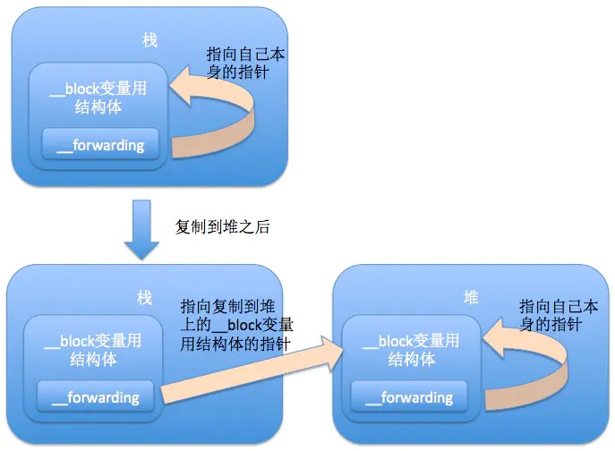

# Block的三种类型

### 三种类型特点：

(堆栈是在运行时分配空间，全局是在编译期就能确定)

* 全局block
  * 位于全局区
  * 在block内部不使用外部变量 or **只使用**全局变量或者静态变量
* 堆区block
  * 位于堆区
  * 前提：在block内部可以使用外部变量或OC属性，并且将block赋值给strong或copy修饰的变量
* 栈区block
  * 位于栈区
  * 前提：在block内部可以使用外部变量或OC属性，并且不对block赋值或者只能赋值给weak修饰的变量

举例说明：


### 面试题

1. 以下代码将会怎样执行？换成注释中的代码又会怎样执行？

   ```objective-c
   - (void)testStackBlock_copy {
       int num = 8;
       void(^__weak weakBlock)(void) = nil;
       {
           void(^__weak weakBlock1)(void) = ^{
               NSLog(@"num = %d",num);
           };  
           weakBlock = weakBlock1;// [weakBlock1 copy];
       }
       
       weakBlock();
       
   }
   ```

   > 答： 
   >
   > ​    1." weakBlock = weakBlock1; "
   >
   > ​     两个block都是stack block，都存储在栈区；栈区空间是方法体空间，中间的'{}'表示匿名作用域，（C语言中介绍）栈存储期间匿名作用域的变量超出匿名作用域不一定立即释放；
   >
   > ​     2. "weakBlock = [weakBlock1 copy];"
   >
   > ​     经过copy后 weakBlock指向的是堆区的空间，在ARC下,编译器在匿名作用域"}"插入了release，weakBlock 指向的区域被自动释放，所以超出"}"调用weakBlock() 会崩溃。        

2. 什么情况下系统不会对block执行copy操作？

答：stack block作为函数参数时，系统无法判断是否需要进行copy，此时不会主动进行copy操作；

#2. block原理探索

## 2.1 block的本质


```objective-c
int main(int argc, const char * argv[]) {
   
    NSObject *obj = [NSObject alloc];
    void (^ strBlock)(void) = ^{
        NSLog(@"obj retainCount: %ld",CFGetRetainCount((__bridge CFTypeRef)obj));
    };
    strBlock();
    
    return 0;
}
```

block代码经过编译生成的c++源码:

```cpp
struct __main_block_impl_0 {
  struct __block_impl impl;
  struct __main_block_desc_0* Desc;
  NSObject *obj;
  __main_block_impl_0(void *fp, struct __main_block_desc_0 *desc, NSObject *_obj, int flags=0) : obj(_obj) {
    impl.isa = &_NSConcreteStackBlock;
    impl.Flags = flags;
    impl.FuncPtr = fp;
    Desc = desc;
  }
};
static void __main_block_func_0(struct __main_block_impl_0 *__cself) {
  NSObject *obj = __cself->obj; // bound by copy

        NSLog((NSString *)&__NSConstantStringImpl__var_folders_kg_jwbbkd7s2zd3q3kqhq5x64wm0000gp_T_main_a63961_mi_5,CFGetRetainCount((__bridge CFTypeRef)obj));
    }
static void __main_block_copy_0(struct __main_block_impl_0*dst, struct __main_block_impl_0*src) {_Block_object_assign((void*)&dst->obj, (void*)src->obj, 3/*BLOCK_FIELD_IS_OBJECT*/);}

static void __main_block_dispose_0(struct __main_block_impl_0*src) {_Block_object_dispose((void*)src->obj, 3/*BLOCK_FIELD_IS_OBJECT*/);}

static struct __main_block_desc_0 {
  size_t reserved;
  size_t Block_size;
  void (*copy)(struct __main_block_impl_0*, struct __main_block_impl_0*);
  void (*dispose)(struct __main_block_impl_0*);
} __main_block_desc_0_DATA = { 0, sizeof(struct __main_block_impl_0), __main_block_copy_0, __main_block_dispose_0};
int main(int argc, const char * argv[]) {

    NSObject *obj = ((NSObject *(*)(id, SEL))(void *)objc_msgSend)((id)objc_getClass("NSObject"), sel_registerName("alloc"));
    void (* strBlock)(void) = ((void (*)())&__main_block_impl_0((void *)__main_block_func_0, &__main_block_desc_0_DATA, obj, 570425344));
    ((void (*)(__block_impl *))((__block_impl *)strBlock)->FuncPtr)((__block_impl *)strBlock);

    return 0;
}

```


```cpp
    void (* strBlock)(void) = ((void (*)())&__main_block_impl_0((void *)__main_block_func_0, &__main_block_desc_0_DATA, obj, 570425344));

    ((void (*)(__block_impl *))((__block_impl *)strBlock)->FuncPtr)((__block_impl *)strBlock);

```


从上图看出:

1. main函数中的strBlock被编译成了一个`__main_block_impl_0`的strut;

2. `__main_block_impl_0` 结构体包含一个`__block_impl`结构体、一个`__main_block_desv_0`结构体和一个捕获的外部变量`obj`；

   

3. `__block_impl`结构体则包含一个isa、一个FuncPtr 和两个int类型标记；


###  如何查看Block类型？

（看👀--> struct 的isa) 📢：这里只是编译成cpp代码的中间类型，经过汇编，如果会copy到堆区最终将修改成mallocblock

## 2.2 block是怎样捕获外部变量的？

对于 block 外的变量引用，block 默认是将其复制到其数据结构中来实现访问的。也就是说block的自动变量截获只针对block内部使用的自动变量, 不使用则不截获, 因为截获的自动变量会存储于block的结构体内部, 会导致block体积变大。特别要注意的是默认情况下block只能访问不能修改局部变量的值。捕获变量分两种情况如下：

* 非`__block`修饰的变量
* `__block`修饰的变量

### 2.2.1 捕获非`__block`修饰的变量

#### 从内存管理语义角度考察

原则：遇强捕强遇弱捕弱

#### 从输出捕获变量值考察

* 捕获外部变量(传递的是值)

* 捕获静态变量(传递的是静态变量的指针)

* 捕获全局变量（没有传递，直接访问的全局区）

* 捕获外部OC对象（传的是对象的值）

  原因：**为了保证block内部能够正常访问外部的变量，block有个变量捕获机制；auto变量age的block访问方式是值传递，static变量num的block访问方式是指针传递，block不需要对全局变量捕获，都是直接采用取全局变量的值**。

  

  

  

  

### 2.2.2 捕获`__block`修饰的变量

对于用 `__block` 修饰的外部变量引用，block 是复制其引用地址来实现访问的。block可以修改__block 修饰的外部变量的值。


通过编译源码解析成的c代码，会发现加上`__block`修饰符的局部变量，竟然跟block一样变成了一个`__Block_byref_bmuArray_0`结构体类型变量实例！！！！

此时我们在block内部访问val变量则需要通过一个叫__forwarding的成员变量来间接访问val变量。


#### `__block变量`与__forwarding



通过__forwarding, 无论是在block中还是 block外访问__block变量, 也不管该变量在栈上或堆上, 都能顺利地访问同一个__block变量。

# 3. block内循环引用解决方案

*  方案一：借助weak

  ```objective-c
  - (void)testBlockLifeCircle_weak {
    __weak typeof(self) weakSelf = self;
  
    self.yl_VBlock = ^{
      NSLog(@"demoName = %@",[weakSelf demoName]);
    };
    self.yl_VBlock();
  }	
  ```

  

* 方案二：借助__block

  ```objective-c
  - (void)testBlockLifeCircle_block {
  
    __block YLBlockRetainCycleViewController *tmpVC = self;
    self.yl_VBlock = ^{
      NSLog(@"demoName = %@",[tmpVC demoName]);
      tmpVC = nil; // 📢：1.必须将变量置为nil
    };
    self.yl_VBlock(); // 📢：2.必须调用block(如果不调不会，解决循环引用)
  }
  ```

  

*  方案三：借助参数

  ```objective-c
  - (void)testBlockLifeCircle_Parameter {
    self.yl_PBlock = ^(YLBlockRetainCycleViewController *vc) {
      NSLog(@"demoName = %@",[vc demoName]);
    };
    self.yl_PBlock(self);
  }
  
  ```

  

*  方案四：使用NSProxy（其实是借助参数传递中间者+中间者弱持有self就可以解决，完全可以不用消息转发）（使用Proxy的原理是：1.添加了一个中间者Proxy；2.Proxy持有一个弱引用对象，也就是响应方法的目标对象；3. 借助消息转发机制将消息传递给目标对象）

  ```objective-c
  - (void)testBlockLifeCircle_Rroxy {
    YLProxy *proxy = [YLProxy proxyWithTarget:self];
    self.yl_PoxBlock = ^(YLProxy *pox) {
      NSLog(@"demoName = %@",[pox.target demoName]);
    };
    self.yl_PoxBlock(proxy);
  }
  ```

  