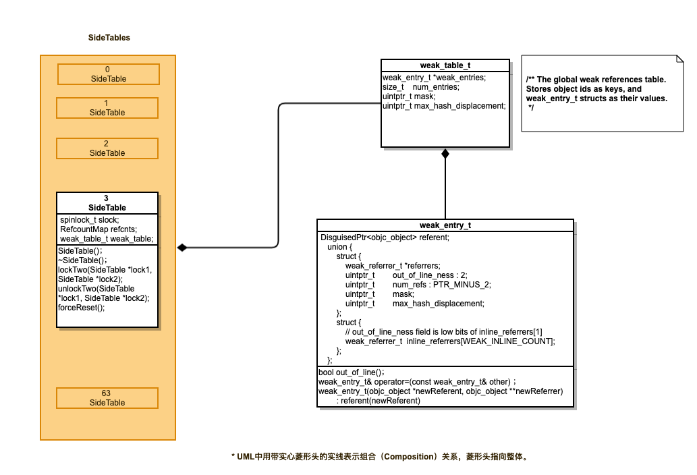

## 实现weak对象的底层数据结构

* SideTables哈希数组 (个人理解为数组下标是通过向某一个哈希函数传入key得到，然后从数组中直接取值)

* weak-table：哈希表（也称散列表， 哈希表本质是一个数组，数组中的每一个元素成为一个箱子，箱子中存放的是键值对）

  两者关系如图：

  

**总结：**

​      底层数据模型：哈希表+数组的形式

（key: 弱引用对象的地址; value：一个存放weak指针的地址的数组）

