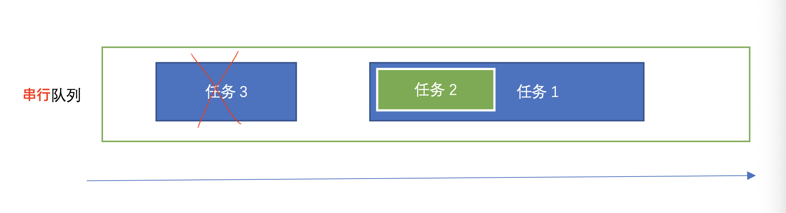

# 1. GCD的基本使用

使用步骤：

1. 创建一个队列（串行队列或并发队列）；
2. 将任务（同步任务或异步任务）追加到任务的等待队列中，然后系统就会根据任务类型执行任务。

## 1.1 创建/获取队列

* 创建队列的方法

  使用`dispatch_queue_create`方法创建队列

  ```objective-c
  dispatch_queue_t s_queue = dispatch_queue_create("queue.yuli.serial", DISPATCH_QUEUE_SERIAL); // 串行队列 
  dispatch_queue_t c_queue = dispatch_queue_create("queue.yuli.concurrent", DISPATCH_QUEUE_CONCURRENT); // 并发队列
  ```

* 获取队列的方法

  系统提供了两个默认队列，主队列（串行）和全局队列（并发）。

  ```objective-c
  dispatch_queue_t m_queue = dispatch_get_main_queue(); // 主队列
  dispatch_queue_t g_queue = dispatch_get_global_queue(DISPATCH_QUEUE_PRIORITY_DEFAULT, 0); // 全局队列
  ```

## 1.2 添加任务

* 同步任务

  ```objective-c
  dispatch_sync(s_queue, ^{
      NSLog(@"这是一个同步任务 4,%@",[NSThread currentThread]);
  });
  ```

* 异步任务

  ```objective-c
  dispatch_async(s_queue, ^{
      NSLog(@"这是一个异步任务 1,%@",[NSThread currentThread]);
  });
  ```


# 2. GCD复杂使用场景

## 2.1 非嵌套场景

a. 串行队列不是主队列

|      | 同步任务+串行队列                                            | 异步任务+串行队列                                            | 同步任务+并发队列                                            | 异步任务+并发队列                                            |
| ---- | ------------------------------------------------------------ | ------------------------------------------------------------ | ------------------------------------------------------------ | ------------------------------------------------------------ |
| 特点 | 1.  同步任务会阻塞住当前任务，等所有同步任务执行完毕才继续执行当前任务后续代码  <br />2．多个同步任务按顺序执行，执行完一个，执行下一个  <br />3. 不开辟新的线程 | 1. 异步任务不会阻塞当前任务而是将异步任务加入串行队列后直接返回，然后继续执行当前任务后续代码 <br /> 2. 多个异步任务会在新线程按加入队列顺序执行，执行完一个，执行下一个  <br />3. 会开辟新线程 | 1. 同步任务会阻塞住当前任务，等所有同步任务执行完毕才继续执行当前任务后续代码<br />  2. 多个同步任务按顺序执行，执行完一个，执行下一个  <br />3. 不开辟新的线程 | 1. 异步任务不会阻塞当前任务而是将异步任务加入串行队列后直接返回，然后继续执行当前任务后续代码；  <br />2. 多个异步任务会在新线程并发执行，顺序不确定  <br />3. 会开辟多条新线程（线程数由内核开销决定） |

代码：

```objc
/// 同步+串行
- (void)testSync_serial {
    NSLog(@"同步+串行---start");
    dispatch_queue_t queue = dispatch_queue_create("queue.yuli.seria", DISPATCH_QUEUE_SERIAL);
    dispatch_sync(queue, ^{
        // 追加任务 1
        [NSThread sleepForTimeInterval:2];              // 模拟耗时操作
        NSLog(@"1---%@",[NSThread currentThread]);      // 打印当前线程
    });
    
    dispatch_sync(queue, ^{
        // 追加任务 2
        [NSThread sleepForTimeInterval:2];              // 模拟耗时操作
        NSLog(@"2---%@",[NSThread currentThread]);      // 打印当前线程
    });
    
    dispatch_sync(queue, ^{
        // 追加任务 3
        [NSThread sleepForTimeInterval:2];              // 模拟耗时操作
        NSLog(@"3---%@",[NSThread currentThread]);      // 打印当前线程
    });
    
    NSLog(@"同步+串行---end");
}

/// 异步+串行
- (void)testAsync_serial {
    NSLog(@"异步+串行---start");
    dispatch_queue_t queue = dispatch_queue_create("queue.yuli.seria", DISPATCH_QUEUE_SERIAL);
    dispatch_async(queue, ^{
        // 追加任务 1
        NSLog(@"start：1---%@",[NSThread currentThread]);      // 打印当前线程

        [NSThread sleepForTimeInterval:2];              // 模拟耗时操作
        NSLog(@"1---%@",[NSThread currentThread]);      // 打印当前线程
    });
    
    dispatch_async(queue, ^{
        // 追加任务 2
        NSLog(@"start：2---%@",[NSThread currentThread]);      // 打印当前线程

        [NSThread sleepForTimeInterval:2];              // 模拟耗时操作
        NSLog(@"2---%@",[NSThread currentThread]);      // 打印当前线程
    });
    
    dispatch_async(queue, ^{
        // 追加任务 3
        NSLog(@"start：3---%@",[NSThread currentThread]);      // 打印当前线程

        [NSThread sleepForTimeInterval:2];
        // 模拟耗时操作
        NSLog(@"3---%@",[NSThread currentThread]);      // 打印当前线程
    });
    
    NSLog(@"异步+串行---end");
}

/// 同步+并发
- (void)testSync_concurrent {
    NSLog(@"同步+并发---start");

    dispatch_queue_t queue = dispatch_queue_create("queue.yuli.concurrent", DISPATCH_QUEUE_CONCURRENT);
    dispatch_sync(queue, ^{
        // 追加任务 1
        [NSThread sleepForTimeInterval:2];              // 模拟耗时操作
        NSLog(@"1---%@",[NSThread currentThread]);      // 打印当前线程
    });
    
    dispatch_sync(queue, ^{
        // 追加任务 2
        [NSThread sleepForTimeInterval:2];              // 模拟耗时操作
        NSLog(@"2---%@",[NSThread currentThread]);      // 打印当前线程
    });
    
    dispatch_sync(queue, ^{
        // 追加任务 3
        [NSThread sleepForTimeInterval:2];              // 模拟耗时操作
        NSLog(@"3---%@",[NSThread currentThread]);      // 打印当前线程
    });
    NSLog(@"同步+并发---end");
}

/// 异步+并发
- (void)testAsync_concurrent {
    NSLog(@"异步+并发---start");

    dispatch_queue_t queue = dispatch_queue_create("queue.yuli.concurrent", DISPATCH_QUEUE_CONCURRENT);
    dispatch_async(queue, ^{
        // 追加任务 1
        [NSThread sleepForTimeInterval:2];              // 模拟耗时操作
        NSLog(@"1---%@",[NSThread currentThread]);      // 打印当前线程
    });
    
    dispatch_async(queue, ^{
        // 追加任务 2
        [NSThread sleepForTimeInterval:2];              // 模拟耗时操作
        NSLog(@"2---%@",[NSThread currentThread]);      // 打印当前线程
    });
    
    dispatch_async(queue, ^{
        // 追加任务 3
        [NSThread sleepForTimeInterval:2];              // 模拟耗时操作
        NSLog(@"3---%@",[NSThread currentThread]);      // 打印当前线程
    });
        
    NSLog(@"异步+并发---end");
}
```

b. 串行队列是主队列，当前任务所在也是主队列（该场景已经是嵌套场景了，姑且放这里吧）

|      | 同步任务+主队列                                              | 异步任务+主队列                                              |
| ---- | ------------------------------------------------------------ | ------------------------------------------------------------ |
| 特点 | 1.  同步任务会阻塞住主队列任务，因为主队列任务被阻塞住迟迟无法完成，后续同步任务也不能开始，长时间互相等待导致当前线程被挂起，主线程被阻塞，出现死锁程序崩溃<br />2. 不开辟新的线程 | 1. 异步任务不会阻塞主队列任务而是将异步任务加入主队列后直接返回，然后继续执行主队列任务后续代码  <br />2. 多个异步任务会在主线程按加入队列顺序执行，执行完一个，执行下一个  <br />3. 不会开辟新线程 |

```objc
/// 同步任务+主队列
- (void)testSync_main {
    NSLog(@"同步任务+主队列---start");

    dispatch_queue_t queue = dispatch_get_main_queue();
    dispatch_sync(queue, ^{
        // 追加任务 1
        [NSThread sleepForTimeInterval:2];              // 模拟耗时操作
        NSLog(@"1---%@",[NSThread currentThread]);      // 打印当前线程
    });
    
    dispatch_sync(queue, ^{
        // 追加任务 2
        [NSThread sleepForTimeInterval:2];              // 模拟耗时操作
        NSLog(@"2---%@",[NSThread currentThread]);      // 打印当前线程
    });
    
    dispatch_sync(queue, ^{
        // 追加任务 3
        [NSThread sleepForTimeInterval:2];              // 模拟耗时操作
        NSLog(@"3---%@",[NSThread currentThread]);      // 打印当前线程
    });
    
    NSLog(@"同步任务+主队列---end");
}

/// 异步任务+主队列
- (void)testAsync_main {
    NSLog(@"异步任务+主队列---start");

    dispatch_queue_t queue = dispatch_get_main_queue();
    dispatch_async(queue, ^{
        // 追加任务 1
        NSLog(@"start：1---%@",[NSThread currentThread]);      // 打印当前线程

        [NSThread sleepForTimeInterval:2];              // 模拟耗时操作
        NSLog(@"1---%@",[NSThread currentThread]);      // 打印当前线程
    });
    
    dispatch_async(queue, ^{
        // 追加任务 2
        NSLog(@"start：2---%@",[NSThread currentThread]);      // 打印当前线程

        [NSThread sleepForTimeInterval:2];              // 模拟耗时操作
        NSLog(@"2---%@",[NSThread currentThread]);      // 打印当前线程 8
    });
    
    dispatch_async(queue, ^{
        // 追加任务 3
        NSLog(@"start：3---%@",[NSThread currentThread]);      // 打印当前线程

        [NSThread sleepForTimeInterval:2];
        // 模拟耗时操作
        NSLog(@"3---%@",[NSThread currentThread]);      // 打印当前线程
    });
    
    NSLog(@"异步任务+主队列---end");
}

```

## 2.2 嵌套场景

a.串行队列（非主队列）




代码（以一种情况为例分析其输出结果）

```objc
/// 【异步】嵌【异步】
- (void)testSerial_async_nest_async {
    dispatch_queue_t queue = dispatch_queue_create("queue.yuli.seria", DISPATCH_QUEUE_SERIAL);
    NSLog(@"---------1---------");
    dispatch_async(queue, ^{
        // 追加任务 1
     NSLog(@"---------2---------");
        dispatch_async(queue, ^{
            // 追加任务 2
          NSLog(@"---------3---------");
          [NSThread sleepForTimeInterval:2];              // 模拟耗时操作
        });
        [NSThread sleepForTimeInterval:2];              // 模拟耗时操作
          NSLog(@"---------4---------");
    });
  
    NSLog(@"---------5---------");
    dispatch_async(queue, ^{
        // 追加任务 3
      NSLog(@"---------6---------");
      [NSThread sleepForTimeInterval:2];   // 模拟耗时操作  
      NSLog(@"---------7---------");
    });

  NSLog(@"---------7---------");

}

/// 结果：1--> 5 --> 8 --> 2 -->  4 --> 6 --> 7 --> 3
```

