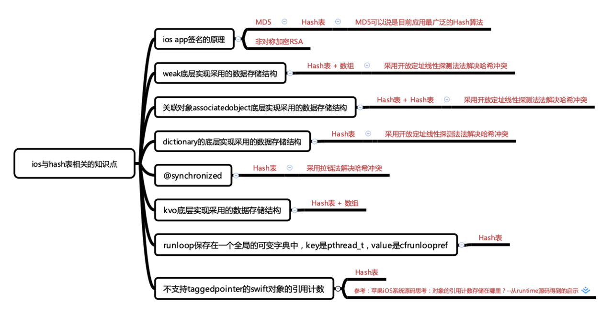

# 1. 数组和链表的区别

* 数组：地址连续，查找速度快，操作效率低；

  存储单元在定义时分配，元素个数固定，内存空间要求高

* 链表：地址不连续，查找速度慢，操作效率高

  存储单元在运行时分配，可按需增减

# 2. 什么是hash表

哈希表(`Hash table`，也叫`散列表`)是根据`键Key`直接访问在内存中存储位置的数据结构。也就是说，它通过计算一个关于`键值的函数`，将所需`查询的数据`映射到表中一个位置来访问记录，这加快了查找速度。这个映射函数叫做`散列函数`，存放记录的数组叫做`散列表`。通俗讲就是把`Key`通过一个固定的`算法函数(hash函数)`转换成一个`整型数字`，然后就对该`数字用数组的长度进行取余`，取余结果就当作`数组的下标`，将`value`存储在以该数字为`下标的数组`空间里。当使用`hash`表查询时，就是使用`hash`函数将`key`转换成对应的`数组下标`，并定位到该下标的数组空间里获取`value`，这样就充分利用到数组的定位性能进行数据定位

# 3. iOS中hash表的使用有哪些？

